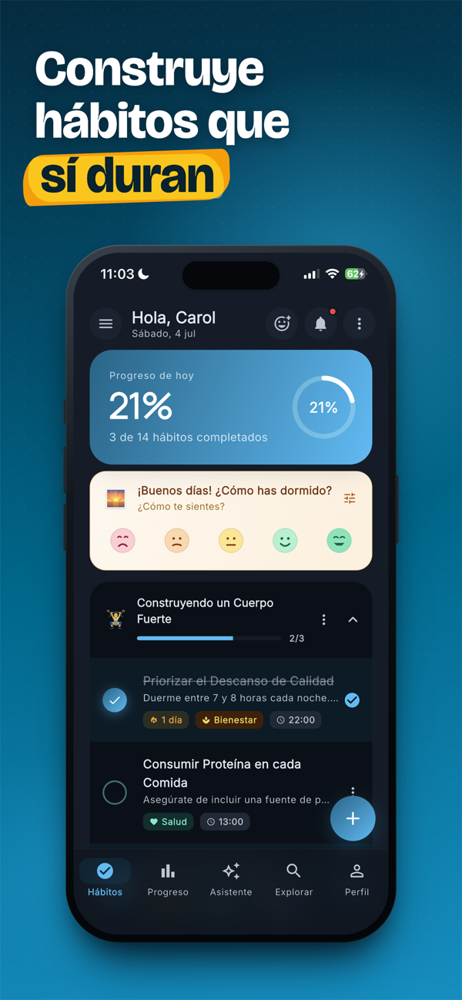
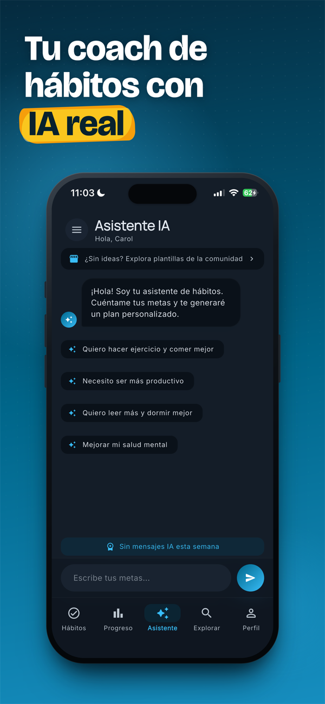
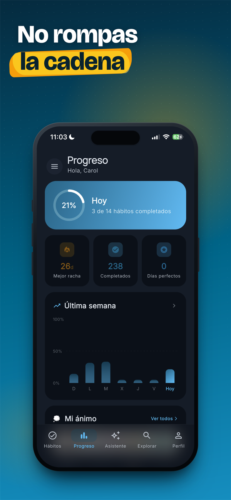
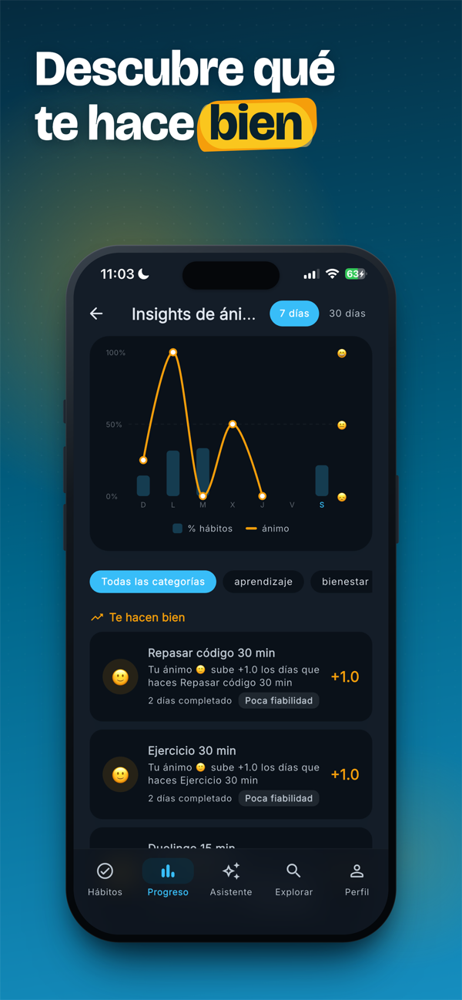
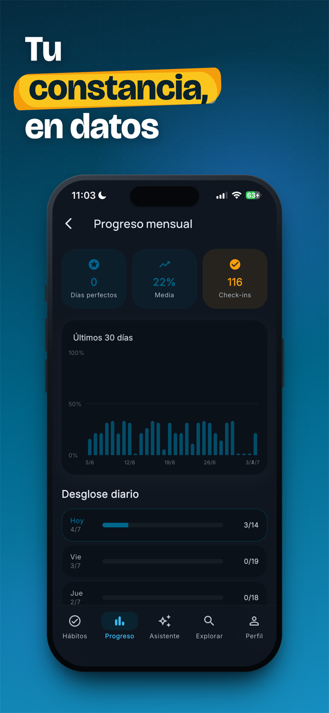
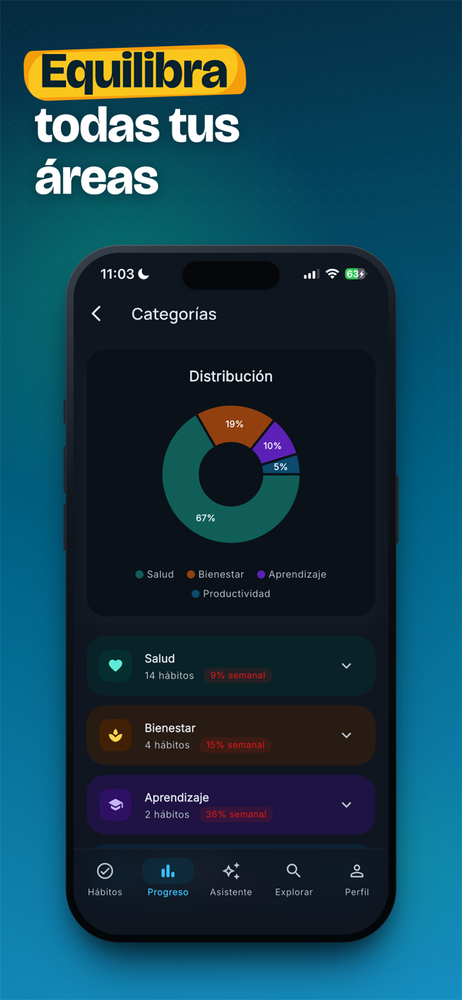

<div align="center">

# HabitAI

**Tu coach de hábitos con IA.** Le cuentas cómo es tu vida, Gemini diseña tu plan,
y la app detecta tus patrones y renegocia contigo cuando fallas.

[](https://apps.apple.com/app/id6777939075)
[](https://flutter.dev)
[](https://firebase.google.com)
[](https://ai.google.dev)
[](LICENSE)

**[Descargar en la App Store →](https://apps.apple.com/app/id6777939075)**

Publicada en julio de 2026 · Trabajo Final de Grado del CFGS de Desarrollo de Aplicaciones Multiplataforma

</div>

---

## La app

| | | |
|:-:|:-:|:-:|
|  |  |  |
| **Hábitos del día** | **Asistente IA** | **Progreso** |
|  |  |  |
| **Ánimo y hábitos** | **Progreso mensual** | **Equilibrio por áreas** |

---

## Qué hace

La mayoría de gestores de hábitos son listas de tareas con rachas. HabitAI intenta
resolver los dos momentos en los que esas apps fallan: **el arranque** (no sabes qué
hábitos ponerte) y **la recaída** (fallas tres días y abandonas).

**Arranque.** En el onboarding describes tu rutina y tus metas en lenguaje natural y
Gemini devuelve un plan completo: hábitos concretos, frecuencia por días, hora de
recordatorio y categoría, agrupados con título y emoji. Todo editable después.

**Recaída.** Cuando fallas un hábito tres o más días, la IA no insiste: te propone un
ajuste concreto —bajar la intensidad, cambiar la hora, partirlo en micro-hábitos o
reducir la frecuencia— acompañado de un diagnóstico de por qué está fallando. Es la
función de la que más orgulloso estoy.

### Seguimiento

- **Check-in diario** con rachas reales (actual y mejor) y feedback háptico.
- **Registro de ánimo** por franja horaria: valoración de 1 a 5, etiquetas emocionales y nota.
- **Correlación ánimo–hábitos**: la app cruza check-ins con estado de ánimo y muestra qué
  hábitos te suben o te bajan el ánimo, con nivel de fiabilidad y efecto retardado (impacto
  en el día siguiente).
- **Dashboard** con gráfica semanal, desglose de 30 días, distribución por categorías y
  heatmap mensual de ánimo estilo GitHub.

### La IA como coach

| Función | Cuándo | Qué genera |
|---|---|---|
| Plan de onboarding | Al registrarte | Grupo de hábitos adaptado a tu rutina |
| Chat del asistente | Cuando quieras | Consejo conversacional sobre tus hábitos reales |
| Revisión semanal | Lunes, automática | Logros, dificultades, recomendaciones y foco de la semana |
| Efecto mariposa | Día 1 de cada mes | Dos futuros a 3 años: manteniendo vs. abandonando los hábitos |
| Renegociación | Al fallar ≥3 días | Ajuste concreto del hábito, con diagnóstico |
| Patrones | Bajo demanda | Insights sobre tus datos de ánimo y constancia |

### Gamificación y social

- Logros (11 tipos) con banner animado, niveles por categoría y radar hexagonal del perfil.
- Escudos de racha para congelarla en días libres o de enfermedad.
- Retos entre usuarios con progreso compartido.
- Plantillas de la comunidad: publicas tus grupos de hábitos y otros los importan con un toque.
- Perfiles públicos opcionales, seguidores con solicitud previa y reacciones.

### Monetización

Suscripción premium gestionada con **RevenueCat**. El plan gratuito funciona con cuota
semanal por tipo de función de IA (3 mensajes de chat, 1 revisión semanal, 1 proyección,
2 renegociaciones…) y premium la elimina. El estado premium **solo se escribe desde el
webhook de RevenueCat validado en el servidor**, nunca desde el cliente, para que nadie
pueda autoconcederse la suscripción falseando un evento.

---

## Arquitectura

Estructura **feature-first**: cada funcionalidad es una carpeta con tres capas propias, sin
dependencias cruzadas entre features.

```
lib/
├── main.dart                     # Init de Firebase + App Check
├── app.dart                      # MaterialApp + AuthProvider
├── core/
│   ├── router/app_router.dart    # go_router con auth guard y ShellRoute
│   ├── theme/                    # Material 3, paleta y tipografía
│   └── widgets/                  # Drawer, snackbars, skeletons, empty states
├── l10n/                         # Localización ES/EN con archivos ARB
└── features/
    ├── auth/          onboarding/     habits/        dashboard/
    ├── ai/            mood/           achievements/  levels/
    ├── challenges/    community/      social/        profile/
    └── explore/       notifications/  premium/       settings/
```

Cada feature respeta el mismo contrato:

- **`domain/`** — Modelos puros, sin una sola importación de Firebase. Es lo que se testea.
- **`data/`** — Repositorios que encapsulan Firestore y las Cloud Functions.
- **`presentation/`** — Pantallas y widgets. Solo hablan con su repositorio.

### El cliente nunca habla con Gemini

```
Flutter  →  Cloud Function (callable)  →  Gemini
              │
              ├── verifica el token de Firebase Auth
              ├── comprueba la cuota semanal (en transacción, sin condiciones de carrera)
              ├── aplica rate limiting (10 peticiones/hora)
              ├── construye el prompt en el servidor
              └── valida y parsea el JSON de respuesta
```

La API key de Gemini vive en Secret Manager y **nunca sale del servidor**. Los prompts
también están en el backend (`functions/prompts/`), así que se corrigen sin publicar una
versión nueva en la App Store.

### Backend: 24 Cloud Functions

Node.js 20 en `europe-west1`, de cuatro tipos:

| Tipo | Nº | Ejemplos |
|---|:-:|---|
| Callables | 7 | `generateHabitPlan`, `routineChat`, `generateRenegotiation` |
| Jobs programados | 9 | `weeklyReviewJob` (lunes 08:00), `butterflyProjectionJob` (día 1, 09:00), `streakRiskJob` |
| Triggers de Firestore | 10 | `onNewFollower`, `onAchievementUnlocked`, `onChallengeProgressUpdated` |
| Webhooks y Pub/Sub | 2 | `revenueCatWebhook`, `pauseAiOnBudgetExceeded` |

Los jobs programados se crean solos con Cloud Scheduler en el primer despliegue, y las
notificaciones push salen por FCM desde los triggers.

**Control de coste**: `pauseAiOnBudgetExceeded` escucha las alertas de facturación de Google
Cloud por Pub/Sub y desactiva las funciones de IA automáticamente al superar el presupuesto.
Un proyecto con IA generativa y tarjeta asociada no debería poder dispararse mientras duermes.

### Modelo de datos

```
users/{uid}
  ├── habits/{habitId}/logs/{logId}
  ├── mood_entries/{entryId}          # privados, nunca salen del usuario
  ├── achievements/{achievementId}
  ├── ai_conversations/{conversationId}
  ├── weekly_reviews/{weekId}         # 2026-W15
  └── butterfly_projections/{monthId} # 2026-04

community_templates/{templateId}/habits/{habitSnapshotId}
challenges/{challengeId}/participants/{uid}
```

### Seguridad

- **Reglas de Firestore deny-by-default**: nada es accesible salvo lo que se autoriza
  explícitamente, y cada documento valida `request.auth.uid == userId`.
- **App Check** activo: las APIs solo responden a instalaciones legítimas de la app.
- **Cuotas y rate limiting en el servidor**, nunca en el cliente.
- **Retención automática**: los documentos temporales llevan `expiresAt` y las políticas TTL
  de Firestore los purgan solas.

---

## Stack

| Capa | Tecnología |
|---|---|
| Frontend | Flutter 3.41 · Dart 3.11 |
| Diseño | Material 3 · `google_fonts` · `flutter_animate` |
| Navegación | `go_router` con auth guard y ShellRoute |
| Gráficas | `fl_chart` |
| Auth | Firebase Authentication (email y Google) |
| Base de datos | Cloud Firestore (Europa) |
| IA | Gemini 2.5 Pro y 2.5 Flash vía `firebase_ai` |
| Backend | Cloud Functions (Node.js 20, `europe-west1`) |
| Jobs | Cloud Scheduler + Pub/Sub |
| Push | Firebase Cloud Messaging |
| Pagos | RevenueCat (`purchases_flutter`) |
| Seguridad | Firebase App Check · reglas de Firestore |
| CI/CD | Codemagic → TestFlight → App Store |
| Idiomas | Español e inglés (ARB) |

---

## Ejecutar el proyecto

Requiere Flutter 3.41+, Node.js 20+ y un proyecto de Firebase en plan Blaze (las Cloud
Functions lo necesitan).

```bash
git clone https://github.com/Fepe7/habit-ai.git
cd habit-ai

# Conecta tu propio proyecto de Firebase
dart pub global activate flutterfire_cli
flutterfire configure

flutter pub get
flutter run
```

Y el backend:

```bash
cd functions
npm install
firebase functions:secrets:set GEMINI_API_KEY
firebase deploy --only functions
```

Tras el primer despliegue, Cloud Scheduler crea automáticamente los nueve jobs programados.

---

## Autor

**Andrei Felipe Staicu** — [github.com/Fepe7](https://github.com/Fepe7)

Trabajo Final de Grado del CFGS de Desarrollo de Aplicaciones Multiplataforma
(IES Salvador Gadea, 2026).

## Licencia

[MIT](LICENSE) — código abierto, citando la autoría.
